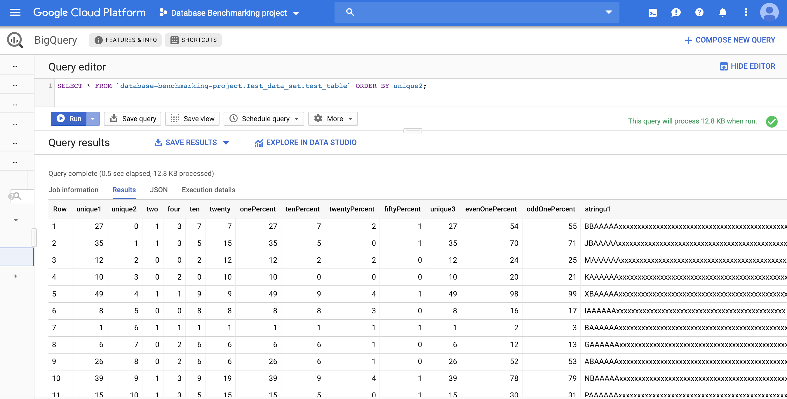
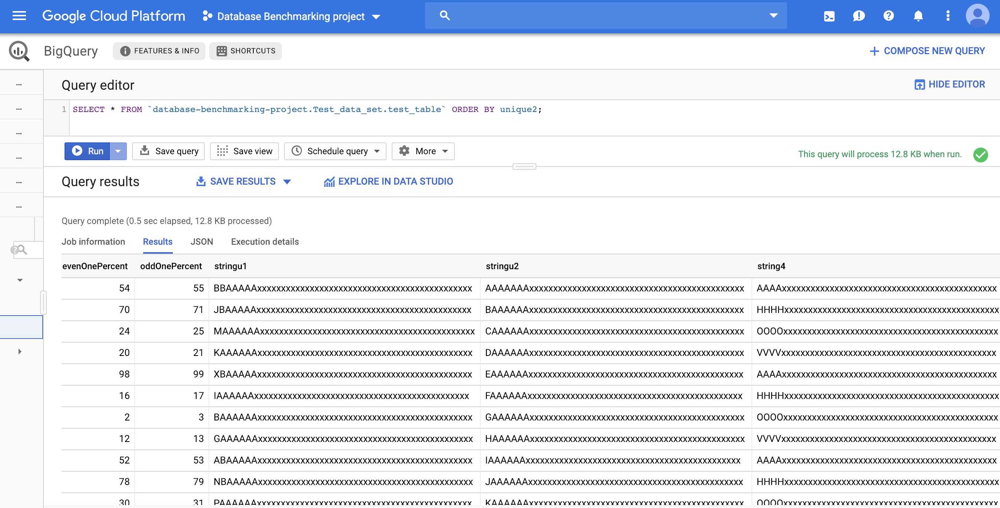

# PSU-487P-DBMS-Project
## Parker Moore
## Carter Wilson

Work for Part 1:
- Wrote .py data generation script according Wisconsin Benchmark specifications. The random unique integers were generated by building a list of the integers from 0 to the desired max, and using the python rand library to shuffle them into a random order. The strings were built using the conversion algorithm provided to us. We used the python csv library to write the data to a .csv file. 
- Uploaded test data .csv to GCP
* note: Every time a new table is generated by the .py file, the order of unique1 will be different

System Selection:
Chose BigQuery(GCP) to gain experience with a system commonly used by major compaines like Snapchat and Airbnb.

Lesson Learned:
- How to create and manage a database in GCP
- How to write a data generation to .csv script

[embed]https://github.com/parker-moore/PSU-487P-DBMS-Project/blob/master/Part%202/CS587%20Project%20pt%202%20Research.pdf
